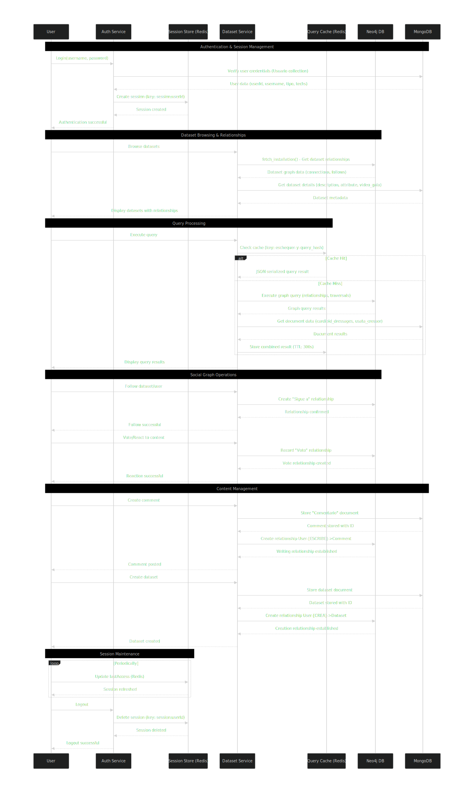
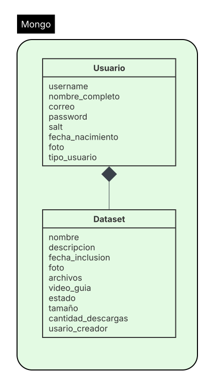
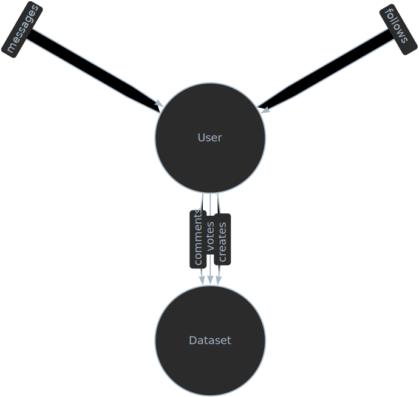
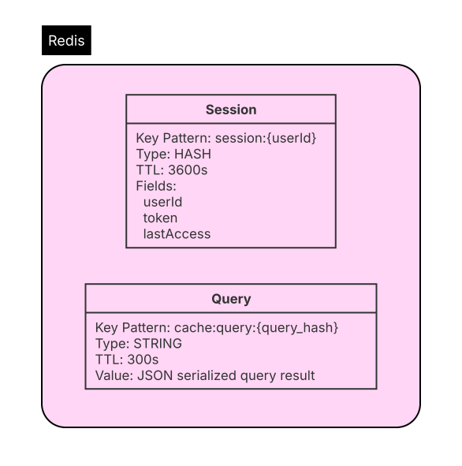

#  Project #1 - Databases II

---

###  Description:

This project consists of implementing key functionalities for a **data sharing web platform** called *Set Sharing Site*. The goal is to allow users to **view, upload, download, share, and manage datasets** within the platform, while integrating **multiple databases** for persistence and querying.

---  

###  Project Initialization

To manage the project containers, use the following Docker Compose commands inside the main folder (`BASES_II`):

| Command | Description |
|----------|--------------|
| `docker-compose build --no-cache` | Rebuilds all Docker images **from scratch**, ignoring any cached layers. Use this when dependencies or configurations have changed. |
| `docker-compose up -d` | Starts all containers **in detached mode** (runs in the background). This is the main command to launch the project. |
| `docker-compose down -v` | Stops and removes all containers **and their volumes**.  This will **delete all stored data**, so use it only if you need a clean environment. |
| `docker compose down --volumes --remove-orphans` | Stops and removes all containers, associated **volumes**, and **orphaned containers** (those not defined in the current `docker-compose.yml`). Useful for full cleanup. |
| `docker-compose restart app` | Restarts only the container named `app`. Use this after code changes without rebuilding all images. |

---
####  Common Startup Flow

1. **Build images from scratch (optional but recommended for clean builds):**
    ```bash
   docker-compose build --no-cache
   ```
2. **Start all services:**
    ```bash
   docker-compose up -d
   ```
3. **If any container fails to start, remove volumes and try again:**
    ```bash
   docker-compose down -v
   docker-compose up -d
   ```
   Note: Removing volumes will **erase all stored data**
   
4. **Restart only the app container (if needed after code edits):**
    ```bash
   docker-compose restart app
   ```
5. **Clean everything completely (containers, volumes, and orphan containers):**
    ```bash
   docker compose down --volumes --remove-orphans
   ```


###  Node.js Dependencies

This project uses the following Node.js dependencies and development tools to manage authentication, file handling, databases, and container auto-reloading.

---

####  Dependencies

| Package | Version | Purpose |
|----------|----------|----------|
| **express** | ^5.1.0 | Web framework used to build the REST API and manage HTTP routes, requests, and middleware. |
| **dotenv** | ^17.2.2 | Loads environment variables from a `.env` file into `process.env`, keeping sensitive configuration values out of the code. |
| **bcryptjs** | ^3.0.2 | Handles password encryption and comparison using secure hashing algorithms. |
| **jsonwebtoken** | ^9.0.2 | Generates and verifies JSON Web Tokens (JWT) for secure user authentication and authorization. |
| **mongoose** | ^8.18.2 | ODM (Object Data Modeling) library for interacting with **MongoDB**, used to model users and datasets. |
| **multer** | ^2.0.2 | Middleware for handling file uploads (e.g., dataset files, images, avatars). |
| **neo4j-driver** | ^6.0.0 | Official **Neo4j** driver for connecting and executing Cypher queries from Node.js. |

---

#### Dev Dependencies

| Package | Version | Purpose |
|----------|----------|----------|
| **nodemon** | ^3.1.10 | Automatically restarts the Node.js application when file changes are detected during development. |
| **ioredis** | ^5.8.0 | Redis client used for caching, managing sessions, and communication between services. |
| **mongoose** | ^8.18.2 | Also included in `devDependencies` to ensure compatibility in testing environments. |

  

##  Databases used

For this project, we decided to use three separate databases to store the data needed to fulfill the project's requirements. Here will be a diagram showing the interaction between the different databases and the web application.



  

###  Document Database

We decided to use a document database to store general user and dataset information, for this we used MongoDB. The Mongo Database we designed contains two main entities; Usuario contains the information needed for user authentication like username, email, password and hash and the information to be displayed on the user's profile, Dataset contains general information for the dataset as well as the download data and usuario_creador.




For the Mongo Database we are using replica set with two containers: mongo1 (primary) and mongo2 (secondary). The replica set ensures data redundancy, high availability, and automatic failover.

mongo1 initializes the replica set (rs0), creates the root admin user, and then restarts with authentication enabled. mongo2 waits until the primary is ready, connects securely, and joins as a secondary node to replicate data.

Both containers use a shared keyfile for internal authentication, ensuring secure communication between nodes. Once running, the system operates with mongo1 as the primary and mongo2 as the secondary, maintaining synchronized and reliable data replication.


---

  

###  Graph Database

In order to represent following, votes and creation relationships, we decided to use a graph database, for this we picked Neo4j. The Neo4j database contains two nodes; Usuario and Dataset. Here we represented following and messaging as a relation `User -> User`, the voting, creation and comment relationships are represented as a `User -> Dataset` relation.



---

  

###  Redis

To store user sessions and cache, we instead used an in-memmory database, this helps us with fast queries without the need for persistency, for this we used Redis. The Redis Database is used for two purposes; User sessions and Caching. For user sessions we use a key like `session:{userId}` and we store userId, a secure token and its last access, it has a time-to-live of 3600 seconds (1 hour). For query caching we use a key like `cache:query:{query_hash}` and we store the output of the query serialized as a JSON, it has a time to live of 300 seconds (5 minutes).



  

####  Initialization

For this Redis DB we are using a master node and a replica. All writes are handled by the master and all reads by the replica. For that we are using the following section of our `docker-compose.yml`.

```

# --------------------------

# Redis Master (Primary)

# --------------------------

redis-master:

image: redis:7

container_name: redis-master

command: redis-server --appendonly yes --requirepass redispass

ports:

- "6379:6379"

volumes:

- redis_master_data:/data

  

# --------------------------

# Redis Replica (Secondary)

# --------------------------

redis-replica:

image: redis:7

container_name: redis-replica

command: redis-server --appendonly yes --replicaof redis-master 6379 --requirepass redispass --masterauth redispass

ports:

- "6380:6379"

depends_on:

- redis-master

volumes:

- redis_replica_data:/data

```

  

####  Testing

After running the docker file, use the command `node src/tests/test-redis.js`. This will try to write into the cluster and then read from it.


###  Authors


| Name  | GitHub |
|------|--------|
| Jorge Luis Rodriguez Cruz |  [@JorgeLuisRodriguezCruz](https://github.com/JorgeLuisRodriguezCruz) |
| Daniel Pulido Castagno |  [@danielpulido01](https://github.com/danielpulido01) |
| Dayana Xie Li  |  [@dayanaxie](https://github.com/dayanaxie) |


  

---